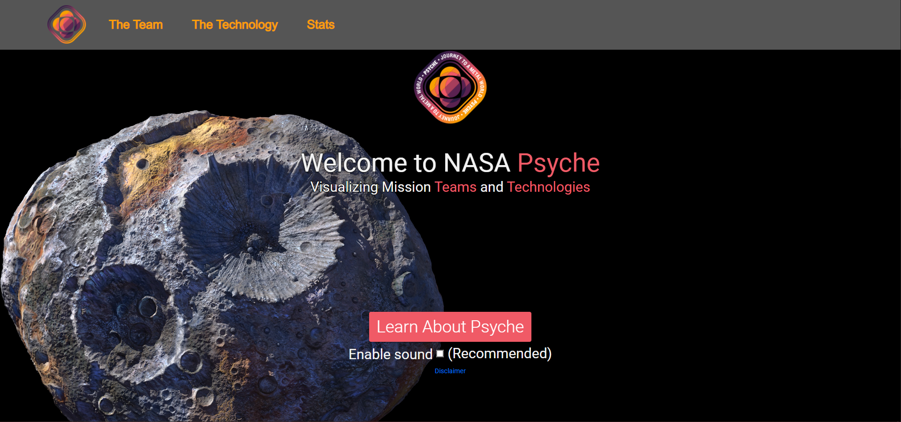

# Introduction


Welcome to the project repository for ASU CSE 485 Capstone project.

# For devs
Please do not directly push your code to `dev` branch, use a new branch to make your change, and create Pull Request for reviewing.

Source code is at the `dev` branch, the `master` branch is for auto build tools to produce the website.

# Prerequisites

* Install the newest `Node.js`
* Install the `Angular CLI` using following command: `npm install -g @angular/cli`
* More detailed set up tutorial can be found [here](https://angular.io/guide/setup-local)

# Set up the environment
Clone this repository: 
```
git clone https://github.com/NASA-Visualization-Mission/page.git
```

Install all dependencies
```
npm install
```

Compiles, and hot reload locally (for debugging and testing)
```
ng serve
```

Checkout to the `dev` branch
```
git checkout -b dev
```

Make a new branch to create Pull Request for making changes
```
git checkout -b feature/testPR
```

Commit your change with message
```
git commit -m "message"
```

Push your changes
```
git push --set-upstream origin feature/testPR
```

Create a PR, and notify team members for reviewing.

After code is approved, merge it into the `dev` branch.
